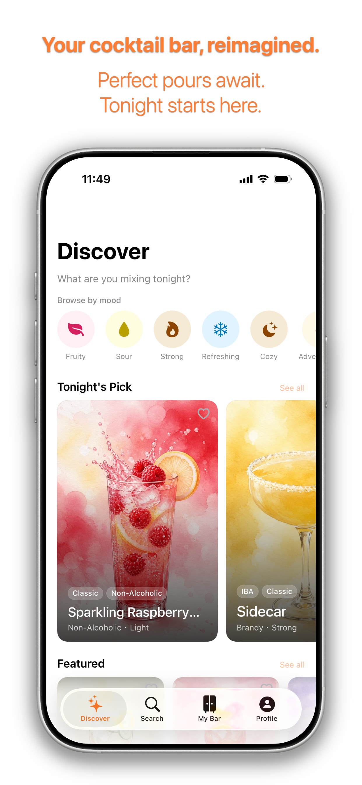

# CocktailCouple Website - Update Templates

Quick templates for common maintenance tasks. Copy-paste and customize!

---

## 📋 Checklist: Update Feature Description

Use this when you want to change what a feature does or says.

### Steps:
- [ ] Open `index.html` in text editor
- [ ] Find: `<!-- Feature 1: Discover -->`  (or Feature 2, 3, 4...)
- [ ] Update the `<h3>` title
- [ ] Update the `<p>` description
- [ ] Update the 3 `<li>` bullet points
- [ ] **Keep**: Image src, HTML structure
- [ ] Save file
- [ ] Test on mobile & desktop
- [ ] Run: `git add . && git commit -m "Update: Feature description"` && git push`
- [ ] Verify at https://dawnix.co.uk

### Example Change:
```html
<!-- Before -->
<h3 class="text-3xl font-bold text-gray-900 mb-4">Discover</h3>
<p class="text-gray-600 mb-4 leading-relaxed">
    Browse our extensive collection...
</p>

<!-- After -->
<h3 class="text-3xl font-bold text-gray-900 mb-4">Discover Cocktails</h3>
<p class="text-gray-600 mb-4 leading-relaxed">
    Explore thousands of hand-crafted cocktail recipes...
</p>
```

---

## 📸 Checklist: Replace App Screenshot

Use this when you have a new app screenshot.

### Steps:
- [ ] Take screenshot of app (1080x1920px minimum)
- [ ] Export as PNG (high quality)
- [ ] Name clearly: `Search-New.png` or `Feature-Name.png`
- [ ] Copy to `./Assets/` folder
- [ ] Open `index.html`
- [ ] Find the image you're replacing: `src="./Assets/OldName.png"`
- [ ] Change to new name: `src="./Assets/NewName.png"`
- [ ] Update `alt` text descriptively
- [ ] Test on mobile & desktop (image should be sharp)
- [ ] Optional: Delete old image from Assets if no longer needed
- [ ] Run: `git add . && git commit -m "Update: Replace app screenshot"` && git push`
- [ ] Verify at https://dawnix.co.uk

### Example:
```html
<!-- Before -->


<!-- After -->

```

---

## 🔗 Checklist: Update Contact Email

Use this if support email changes.

### Steps:
- [ ] Open `index.html`
- [ ] Find & Replace: `support@dawnix.co.uk`
- [ ] Change to: `newemail@example.com` (or whatever)
- [ ] Locations will be: Privacy section, Terms section, Footer
- [ ] Test all email links work
- [ ] Run: `git add . && git commit -m "Update: Change contact email"` && git push`
- [ ] Verify at https://dawnix.co.uk

### Find & Replace in VS Code:
1. Press `Ctrl+H` (Windows) or `Cmd+H` (Mac)
2. Find: `support@dawnix.co.uk`
3. Replace: `newemail@example.com`
4. Click "Replace All"
5. Review changes in 3 locations
6. Save file

---

## 🎨 Checklist: Change Brand Color

Use this if you want to use a different primary color (not just #FF7A00).

### Steps:
- [ ] Open `index.html`
- [ ] Find `<style>` section (around line 25)
- [ ] Find: `--primary-orange: #FF7A00;`
- [ ] Change hex to new color: `--primary-orange: #FF6600;` (example)
- [ ] Save file
- [ ] View in browser - all orange elements should change
- [ ] Test on different sections (buttons, links, accents)
- [ ] Make sure contrast is good (readable text)
- [ ] Run: `git add . && git commit -m "Update: Change brand color"` && git push`
- [ ] Verify at https://dawnix.co.uk

### Color Suggestions:
- **Blue**: `#0066FF` or `#0066CC`
- **Red**: `#FF0000` or `#CC0000`
- **Green**: `#00CC00` or `#009900`
- **Purple**: `#9900FF` or `#660099`

---

## 📝 Checklist: Update Privacy Policy

Use this when privacy practices change.

### Steps:
- [ ] Open `index.html`
- [ ] Find: `<!-- ========== PRIVACY SECTION ========== -->`
- [ ] Find the section you want to update (numbered 1-5)
- [ ] Edit **content only**, keep `<h3>` and `<ul>` structure
- [ ] Update: `<p>` text and `<li>` items
- [ ] Keep: All HTML tags, formatting, structure
- [ ] At bottom: Update date in `<p class="text-sm text-gray-500">Effective Date: May 2024</p>`
- [ ] Test: Click #privacy-section link from footer
- [ ] Run: `git add . && git commit -m "Update: Privacy Policy"` && git push`
- [ ] Verify at https://dawnix.co.uk/privacy-section

### Sections:
1. **Information We Collect** - What data is collected
2. **How We Use Your Information** - Why the data is used
3. **Data Storage & Security** - How data is protected
4. **Third-Party Services** - Who else sees the data
5. **Contact Us** - Email for privacy questions

### Example:
```html
<!-- Before -->
<div>
    <h3 class="text-2xl font-bold text-gray-900 mb-4">1. Information We Collect</h3>
    <p class="mb-3">CocktailCouple collects the following...</p>
    <ul class="list-disc list-inside space-y-2 ml-2">
        <li>Personal profile information...</li>
    </ul>
</div>

<!-- After: Update text in <p> and <li> tags -->
<div>
    <h3 class="text-2xl font-bold text-gray-900 mb-4">1. Information We Collect</h3>
    <p class="mb-3">NEW TEXT HERE...</p>
    <ul class="list-disc list-inside space-y-2 ml-2">
        <li>NEW BULLET POINT...</li>
    </ul>
</div>
```

---

## 📄 Checklist: Update Terms of Service

Use this when terms change.

### Steps:
- [ ] Same as Privacy Policy steps above
- [ ] Find: `<!-- ========== TERMS SECTION ========== -->`
- [ ] Edit content in sections 1-6
- [ ] Update date at bottom
- [ ] Test: Click #terms-section link
- [ ] Commit & push as usual

### Sections:
1. **License Grant** - How users can use the app
2. **Disclaimer of Warranties** - What's not guaranteed
3. **User Conduct** - What users agree NOT to do
4. **Limitation of Liability** - What you're not responsible for
5. **Modification of Terms** - Right to change terms
6. **Contact** - Email for questions

---

## 🚀 Checklist: Deploy Changes

Use this after making ANY updates.

### Steps:
- [ ] Open Terminal
- [ ] Navigate to project: `cd '/Users/hupochuan/Work/Coctail Dawnix Website'`
- [ ] Stage changes: `git add .`
- [ ] Create commit: `git commit -m "Update: [describe what changed]"`
- [ ] Push to GitHub: `git push origin main`
- [ ] Wait 1-2 minutes
- [ ] Open browser: https://dawnix.co.uk
- [ ] Hard refresh: `Cmd+Shift+R` (Mac) or `Ctrl+Shift+R` (Windows)
- [ ] Verify changes are live
- [ ] Test on mobile (DevTools device toggle)

### Commit Message Examples:
```
git commit -m "Update: Change feature descriptions"
git commit -m "Update: Add new app screenshots"
git commit -m "Update: Change contact email"
git commit -m "Update: Refresh privacy policy"
git commit -m "Update: Change brand color to blue"
```

---

## 🧪 Checklist: Test Before Publishing

### Pre-Deployment Testing:

**Desktop (1200px+):**
- [ ] All sections visible and aligned
- [ ] Text readable, good contrast
- [ ] Images sharp and centered
- [ ] Buttons clickable, hover effects work
- [ ] Navigation sticky at top
- [ ] All anchor links scroll smoothly
- [ ] Footer visible with all links

**Tablet (768px-1023px):**
- [ ] Desktop menu visible
- [ ] 2-column layouts work (text + image)
- [ ] All text readable on smaller screen
- [ ] Images fit without stretching
- [ ] Buttons properly spaced
- [ ] No overflow or cutoff content

**Mobile (320px-767px):**
- [ ] Mobile menu button appears
- [ ] Mobile menu opens/closes
- [ ] 1-column layout (all content stacks vertically)
- [ ] Text large enough to read
- [ ] Images scale down properly
- [ ] Buttons full-width and tappable
- [ ] No horizontal scrolling

**All Devices:**
- [ ] Links work (test 5+ links)
- [ ] Images load (no 404 errors)
- [ ] No console errors (F12 → Console)
- [ ] Page loads within 3 seconds
- [ ] Smooth scrolling (click anchor links)

### How to Test:
1. **Local file**: Open index.html in browser
2. **DevTools**: Press F12
3. **Device toggle**: Click phone icon in DevTools
4. **Test different sizes**: Resize window, select preset devices
5. **Check console**: Look for red error messages

---

## 📞 Checklist: Get Help

If something breaks:

### Troubleshooting Steps:
1. [ ] Hard refresh website: `Cmd+Shift+R` (Mac)
2. [ ] Check DevTools Console (F12) for errors
3. [ ] Verify file was saved
4. [ ] Verify git push succeeded (check GitHub)
5. [ ] Wait 3 minutes for GitHub Pages rebuild
6. [ ] Try different browser (Chrome, Safari, Firefox)
7. [ ] Check file path for images: `./Assets/FileName.png`

### If Still Stuck:
- Email: support@dawnix.co.uk
- Check: MAINTENANCE_GUIDE.md (Troubleshooting section)
- Review: Git history for what changed

---

## 📋 Template: Batch Update Multiple Sections

If updating multiple things at once:

### Steps:
- [ ] **Feature #1**: Update title, description, bullets
- [ ] **Feature #2**: Update screenshots, alt text
- [ ] **Email**: Replace all instances
- [ ] **Privacy**: Update section 2
- [ ] Test all changes locally
- [ ] Verify on mobile & desktop
- [ ] Single commit: `git commit -m "Update: Multiple sections"`
- [ ] Push: `git push origin main`
- [ ] Verify at https://dawnix.co.uk

### Good Practice:
- Make related updates in one commit
- Use clear commit message describing all changes
- Test everything before pushing
- Wait for 1 deploy before making next changes

---

## 🎯 Quick Reference: File Locations

| What to Update | Where to Find |
|---|---|
| Feature title/description | Search: `<!-- Feature X: -->` |
| App screenshots | `./Assets/` folder |
| Contact email | Search: `support@dawnix.co.uk` |
| Brand color | Find: `--primary-orange:` in `<style>` |
| Privacy content | Search: `<!-- ========== PRIVACY SECTION ========== -->` |
| Terms content | Search: `<!-- ========== TERMS SECTION ========== -->` |
| Footer info | Search: `<!-- Footer -->` or scroll to bottom |
| SEO title | Find: `<title>` in `<head>` |
| SEO description | Find: `<meta name="description"` |

---

## ✅ Final Checklist: Launch Day

Before going live with website:

- [ ] All content reviewed for typos
- [ ] Images all uploaded and displaying
- [ ] Links tested (internal and external)
- [ ] Mobile responsiveness verified
- [ ] Accessibility checked (alt text, contrast)
- [ ] Privacy policy & terms complete
- [ ] Contact email configured
- [ ] Google Analytics added (if wanted)
- [ ] Domain CNAME configured (dawnix.co.uk)
- [ ] Final hard refresh to clear cache
- [ ] Website live on https://dawnix.co.uk

---

**Last Updated**: May 2026  
**For Help**: See MAINTENANCE_GUIDE.md  
**Questions?**: support@dawnix.co.uk
